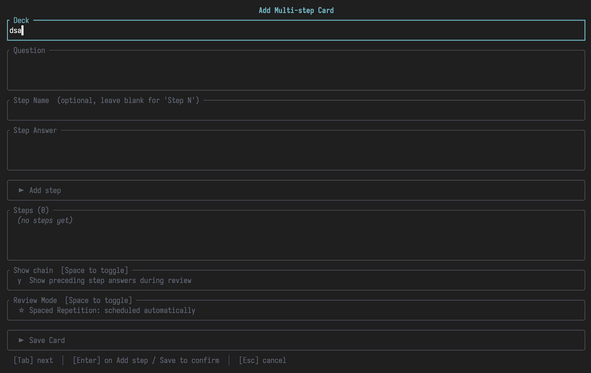
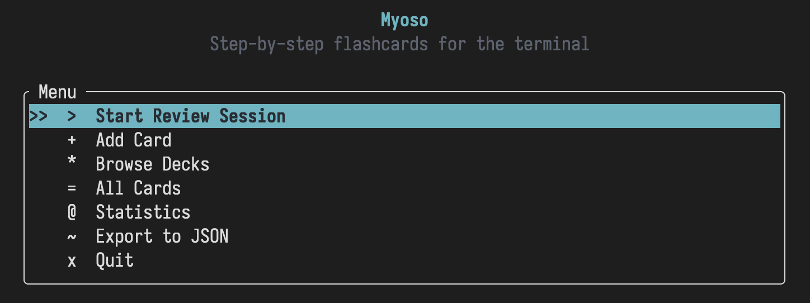
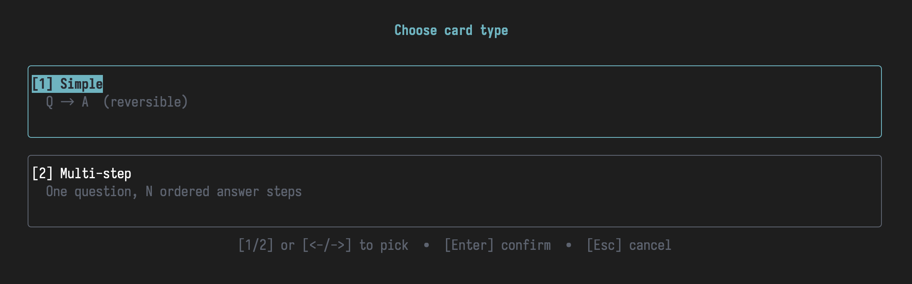

# myoso

Step-by-step spaced-repetition flashcards for the terminal.

Built in Rust with [Ratatui](https://ratatui.rs/) and [SQLite](https://sqlite.org/) for storage.

---


<p align="center">
    
</p>

<p align="center">
    
    
</p>

## What is it?

Standard flashcard apps are great for 1:1 facts and definitions but struggle with long chain
**procedural knowledge**, things like:
- "What are all the verb endings in past, present, future tense?"
- "how do I reverse a linked list?"
- "walk me through this calculus derivation".

Myoso lets you create cards with **ordered steps**. During review you
reconstruct the full reasoning chain one step at a time, rating each step
separately. Spaced repetition then schedules each step independently so that
you must "unlock" the later steps. Likewise, forgetting an earlier step
will "de-unlock" the following step in that chain.

---

## Installation

```bash
git clone https://github.com/vmargb/Myoso.git
cd myoso
cargo run
```

---

## Review TUI controls

| Key | Action |
|-----|--------|
| `Space` / `Enter` | Reveal the answer for the current step |
| `1` | Rate: **Again** - total blank, short reset |
| `2` | Rate: **Hard** - recalled with significant effort |
| `3` | Rate: **Good** - recalled correctly |
| `4` | Rate: **Great** - recalled correctly & quickly |
| `5` | Rate: **Easy** - instant/effortless |
| `q` / `Esc` | Quit the session |

---

## Scheduling algorithm

Uses a simplified SM-2 variant.  Each **item** (step) is tracked independently:

| Rating | Ease delta | Interval multiplier |
|--------|-----------|---------------------|
| 1 Again | −0.20 | reset to 0.5 days |
| 2 Hard  | −0.05 | × 1.2 |
| 3 Good  |  0.00 | × 2.0 |
| 4 Great | +0.05 | × 2.5 |
| 5 Easy  | +0.10 | × 3.5 |

Ease is clamped to `[1.3, 3.0]`.  The first interval is always 1 day.

For **multi-step** cards the session logic is:
- Find the earliest-due step (by position).
- Include **all preceding steps** plus that step in the session.
- This forces you to rebuild the full chain from step 1 every time, not just
  practise the due step in isolation.

---
