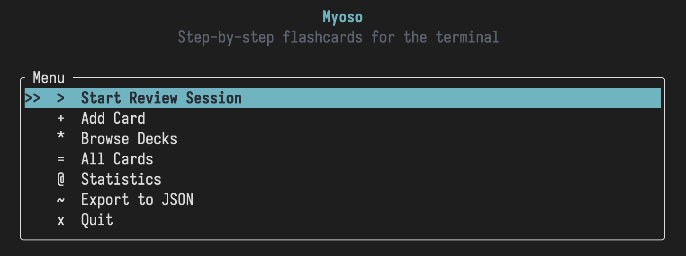
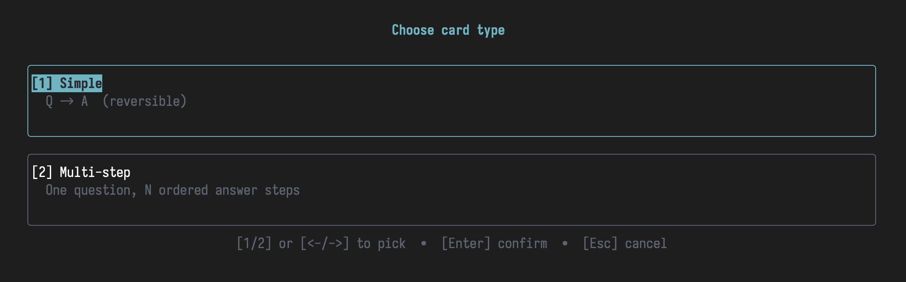
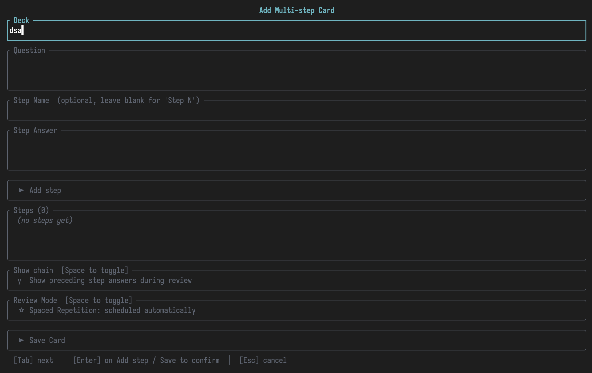

## Myoso
*Step-by-step flashcards for the terminal*
*Built in Rust with [Ratatui](https://ratatui.rs/) and [SQLite](https://sqlite.org/)*

---

<p align="center">
    
    
</p>
<p align="center">
    
</p>

---

## What is it?

Ordinary flashcard apps are great for 1:1 facts and definitions but struggle with *long chain of thought* or
**Step-by-step knowledge**:
- "What are all the verb endings in past tense?"
- "how do you reverse a linked list?"
- "walk me through this derivation".

Standard flashcard *can* be used in this way, but wind up becoming **heavy**, carrying too much mental load. A deck with hundreds(or thousands) of these *heavy* cards quickly become unsustainable to maintain long-term.

Myoso fixes this problem by modellling your answer as an ordered sequence of steps. During review, you **reveal and rate each step** individually, unlocking later steps only after earlier ones are recalled well. Likewise, forgetting an *earlier* step naturally blocks access to the subsequent steps until you **rebuild the chain again**. This reinforces the full procedural flow, rather than merely memorising isolated bits as normal flashcards would do.

---

## Installation

### Quick install (recommended)

You can install the latest release with a single command:

#### Linux / macOS
```sh
curl -sSf https://raw.githubusercontent.com/vmargb/Myoso/main/install.sh | sh
```

#### Windows
Open "PowerShell" or "Windows Terminal":
```powershell
irm https://raw.githubusercontent.com/vmargb/Myoso/main/install.ps1 | iex
```

After installation, run:
```sh
myoso
```

## Updating

To update to the latest version:
```sh
myoso update
```

Check your current version with:
```sh
myoso --version
```

## Building from source (optional)
If you want to compile it manually, install Rust from [rustup.rs](https://rustup.rs) (or with your package-manager) then:

```sh
git clone https://github.com/vmargb/Myoso.git
cd myoso
cargo run
```

---

## Features

- **Analytics**: Simple statistics of deck/card data, current progress and currently due sessions.
- **Reversible cards**: Support for making cards reversible, where q->a becomes a->q.
- **Step-by-step cards**: Cards that require multiple steps towards the answers, where each step is rated individually.
- **Import/Export**: Export a specific deck or all decks into `JSON` format, which can be imported by anyone else.
- **External Editor Support**: Open any textbox in your default editor (e.g., Neovim, VS Code, Notepad) directly from the TUI. Works seamlessly across all operating systems. Close the editor to automatically return to the TUI with your updated text.
- **Markdown Rendering**: All markdown formatting (e.g., bold, italics, lists) is now rendered during review sessions.
- **Syntax Highlighting**: Code blocks in markdown are syntax-highlighted for any programming language.
- **Image preview**: Insert path to images locally into an answer/step (handwritten work or screenshot)
- **Subdecks**: Organise decks into 'sub-decks', allowing clear separation (e.g., vocabulary, grammar)
- **Tags**: Organise cards even further by adding tags, allowing easy search filtering
- **Leach detection**: Automatically flags steps you keep failing and offers some interventions to handle them

### Daily cards

Spaced-repetition isn't everything, some cards require more attention than others,
like the most essential cards in your upcoming exam.
You can mark new cards as daily or move existing SRS cards into your dailies to have them
shown in every review session once per day, bypassing any scheduling applied to them.
Once the demand is gone(e.g. after the exam), you can move those cards back into SRS.

---

## Scheduling algorithm

`Myoso` now uses **FSRS** (Free Spaced Repetition Scheduler). FSRS has been modified to track each **item** (step) independently using two properties:
1. *stability* (how long the memory lasts)
2. *difficulty* (how hard the item is for you personally)

Intervals are calculated to target a 90% recall probability at review time, and both properties update after every rating.

| Key | Action |
|-----|--------|
| `1` | **Again**: complete blank |
| `2` | **Hard**: correct but with major effort |
| `3` | **Good**: correct with some effort |
| `4` | **Easy**: recalled instantly and effortlessly |

> [!NOTE]
> It is highly recommended to avoid the `4` option.
> Reserving it only for **rare** occassions for optimal recall performance.

Additionally, `Myoso` handles a unique *re-exposure* problem where you repeatedly rate a step as `good` or `easy` because you had just recently saw it(from rebuilding the steps again in the **same session**). This would artificially *inflate* the cards schedule because you stacked multiple `easy`'s on the same steps. Therefore, any *re-exposure* ratings now introduce a **tapering effect** against the SRS algorithm to prevent this inflation.

---

## Weak-step handling

Some steps just don't stick, with multiple `again` and `hard` ratings. In standard flashcards these are called **leaches**, which are usually removed out of the review queue. However, Myoso can't simply remove an intermediary step in a chain. Instead it offers a couple alternatives to pick from:

- **cloze-deletions**: highlight the exact word, formula or phrase in the answer that's actually tripping you up
- **split into two steps**: If a step is too difficult, you may need to split it to make recall easier

**Mark blind spot (cloze deletion)**

If you recall the *clozed* parts right enough times, the step graduates back to normal full-recall review. These lighter reviews don't touch your normal schedule, they exist purely to rebuild the specific bit of recall that was missing.

Both leech detection and blind-spot marking run per **step** (or per simple-card item), not per card, so a single stubborn step in an overall solid card gets a little help without dragging the rest of the chain into it.
