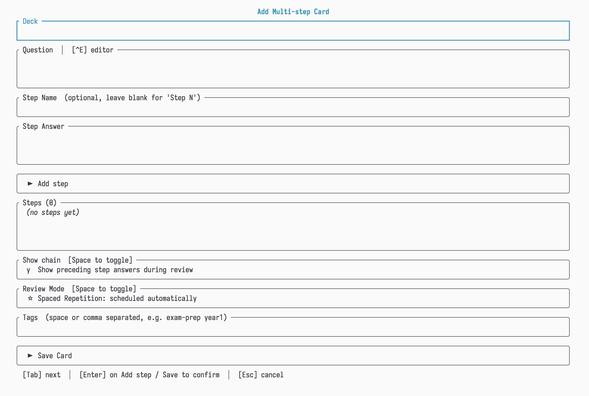
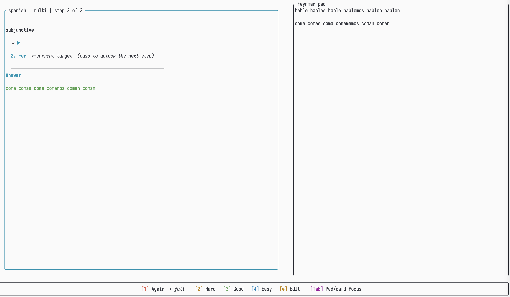
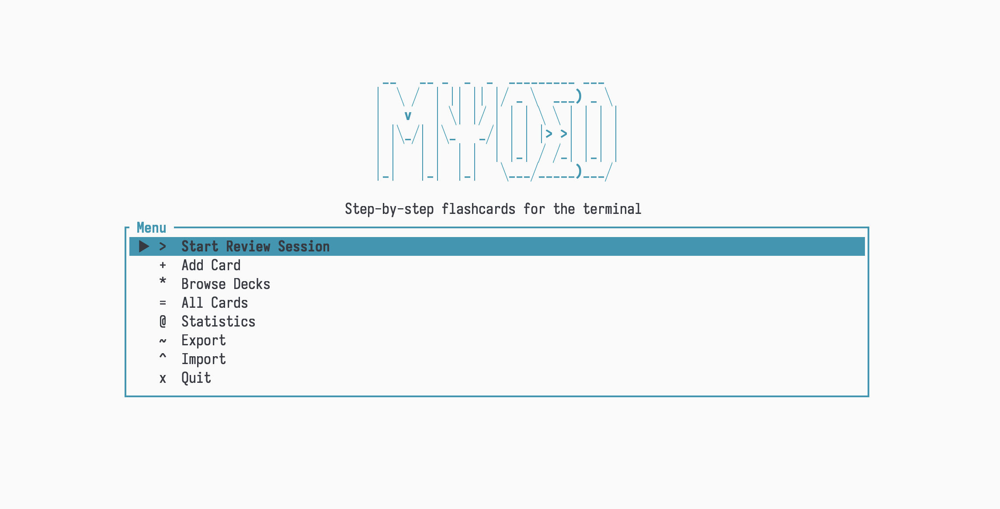

## Myoso
*Step-by-step flashcards for the terminal*
*Built in Rust with [Ratatui](https://ratatui.rs/) and [SQLite](https://sqlite.org/)*

---

<table align="center">
  <tr>
    <td align="center">
      
      <br><b>Add Card</b>
    </td>
    <td align="center">
      
      <br><b>Review Session</b>
    </td>
  </tr>
  <tr>
    <td colspan="2" align="center">
      
      <br><b>Main Menu</b>
    </td>
  </tr>
</table>

---

## What is it?

Ordinary flashcard apps are great for one-to-one facts and definitions, but they struggle with long chains of thought: "What are all the verb endings in the past tense?", "How do you reverse a linked list?", "Walk me through this derivation". You *can* squeeze these into normal cards with one retrieval step, but this requires too much to hold in your head at once, and a deck with hundreds of these heavy cards quickly becomes unsustainable and impossible to maintain long-term.

Myoso fixes this by modelling your answer as an ordered sequence of retrieval steps. During review you reveal and rate each step individually, where later steps unlock once the earlier ones are recalled well. If you forget an early step, the ones after it is blocked again until you rebuild the chain. This reinforces the whole procedural flow, rather than memorising isolated / separated fragments the way a normal flashcard do.

### Branching paths

An answer(or chain of thought) can have multiple routes.

Instead of writing the question twice, you can give it several banching paths. Each path is its own sequence of steps, and every one of them comes back for review on its own schedule.

Paths can also **fork** in the *middle* of a chain. Any step can split apart into different branches midway, so a card grows into a small *tree of thought*, with a shared trunk of reasoning that forks wherever the problem can genuinely go more than one way. Branches stay independent of each other, forgetting a step in one branch only blocks what sits beneath it, so struggling with path A never resets path B.

In the card editor, press `b` on a **step** to start a new branch beneath it and `r` to start a whole new path from the question itself. Press `d` to remove the selected step (anything below it moves up) or `D` to remove it together with everything beneath it. When a step has several branches, each one needs a name so you can tell which direction you are going during review.

---

## Installation

### Quick install (recommended)

You can install the latest release with a single command:

#### Linux / macOS
```sh
curl -sSf https://raw.githubusercontent.com/vmargb/Myoso/main/install.sh | sh
```

#### Windows
Open "PowerShell" or "Windows Terminal":
```powershell
irm https://raw.githubusercontent.com/vmargb/Myoso/main/install.ps1 | iex
```

After installation, run:
```sh
myoso
```

> [!WARNING]
> Myoso used to open(and create) `flashcards.db` in whatever directory you ran `myoso` from, not in a fixed location. Which would operate on different, unsynced databases. You now run an old path with `myoso --db /path/to/flashcards.db`, to continue using your old decks.

## Updating

To update to the latest version:
```sh
myoso update
```

Check your current version with:
```sh
myoso --version
```

## Building from source (optional)
If you want to compile it manually, install Rust from [rustup.rs](https://rustup.rs) (or with your package-manager) then:

```sh
git clone https://github.com/vmargb/Myoso.git
cd myoso
cargo run
```

---

## Daily cards and Cram mode

Spaced-repetition isn't everything, some cards require more attention than others,
like the most essential cards for an upcoming exam.
You can mark new cards as daily or move existing SRS cards into your dailies to have them
shown in every review session once per day, bypassing any scheduling applied to them.
Once the demand is gone(e.g. after the exam), you can move those cards back into SRS.

You can also use the **cram** feature on a deck or a filtered search to get through as many cards
as possible in a day, just in case you don't have enough time to benefit from Spaced-repetition.


## Generating decks with AI

You can ask an AI to write a whole deck for you. Myoso imports a compact "outline" format that holds only the content of your cards: a question with an answer, a list of steps, and named branches wherever the reasoning forks. There are no ids or scheduling data for the AI to get wrong, and Myoso builds the chains and branches itself when you import. Simply ask the AI for a map of the subject first and then for one deck at a time. A ready-made prompt for both stages lives in [`docs/ai-deck-prompt.md`](docs/ai-deck-prompt.md), next to a sample deck in [`docs/example-c-deck.jsonl`](docs/example-c-deck.jsonl).

Import the file from the menu like any other. Myoso will recognize the format on its own, skips cards you already have, imports everything that is valid, and shows what was rejected. The full list of rejected cards is saved next to your file, so you can hand it straight back to the AI to fix.

---

## Scheduling algorithm

`Myoso` now uses **FSRS** (Free Spaced Repetition Scheduler). FSRS has been modified to track each **item** (step) independently using two properties:
1. *stability* (how long the memory lasts)
2. *difficulty* (how hard the item is for you personally)

You rate each step with a single key:

| Key | Rating | Meaning |
|-----|--------|---------|
| `1` | **Again** | Complete blank |
| `2` | **Hard** | Correct, but with major effort |
| `3` | **Good** | Correct, with some effort |
| `4` | **Easy** | Recalled instantly and effortlessly |

> [!NOTE]
> It is highly recommended to avoid the `4` option.
> Reserving it only for **rare** occassions for optimal recall performance.

Additionally, `Myoso` handles a unique problem called *re-exposure*, triggered by repeatedly rating a step as `good` or `easy` after you had just recently seen it(from rebuilding the same steps in the **same session**). This would artificially *inflate* the cards schedule because you stacked multiple positive ratings on the same steps. Therefore, any *re-exposure* ratings now introduce a **tapering effect** against the SRS algorithm to prevent this inflation. The exception is a step that has just been marked as due again because something earlier was forgotten. That step needs a real rating, so its rating always counts.

---

## Leech detection and intervention

Some steps just don't stick, and collect `again` and `hard` ratings over and over. In Anki these are called leeches and are usually pulled out of the review queue. Myoso can't simply remove a step from the middle of a chain, so it offers two alternatives instead.

A **cloze test** lets you highlight the exact word, formula or phrase that keeps tripping you up, and future reviews hide just that part. These lighter reviews never touch your normal schedule. They exist only to rebuild the specific piece of recall that was missing, and once it is back the step returns to normal full-recall review. If the whole step is too much to hold at once, you can instead **split it in two**, so that each half is easier to remember.
